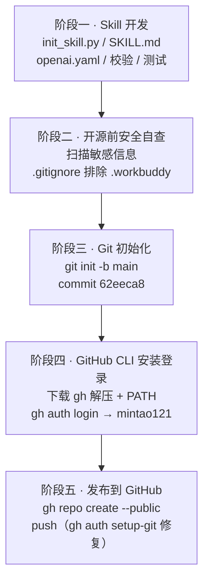
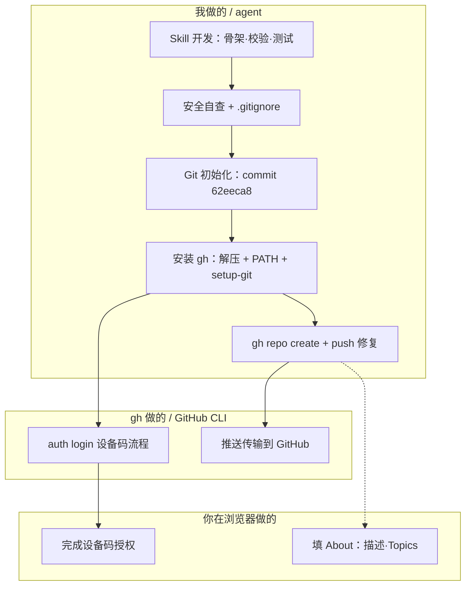
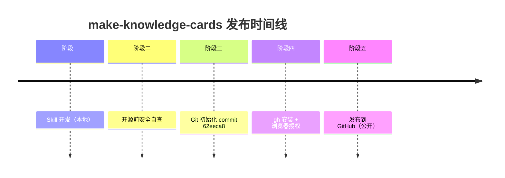

# 发布流程图（make-knowledge-cards）

同一套流程的三种视图：流程图、泳道图、时间线。在 GitHub 上本文件会被自动渲染为图。

## 1. 流程图（Flowchart）

## 2. 泳道图（Swimlane）

按角色分三栏：我（agent 执行）、gh（GitHub CLI 自动动作）、你（浏览器里手动完成）。

## 3. 时间线（Timeline）

## 关键坑

`gh auth login` 之后必须再跑一次 `gh auth setup-git`，把 GitHub 的凭据助手指向
`gh.exe auth git-credential`，否则 `git push` 会卡在凭据选择器（`credential.helper helper-selector`）。
